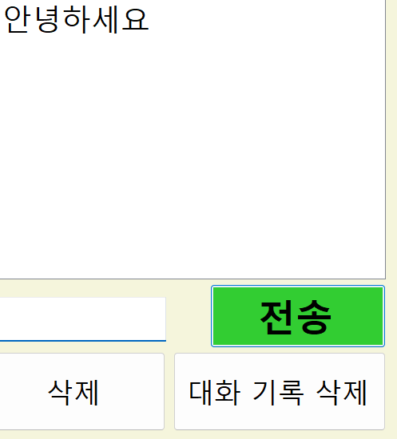
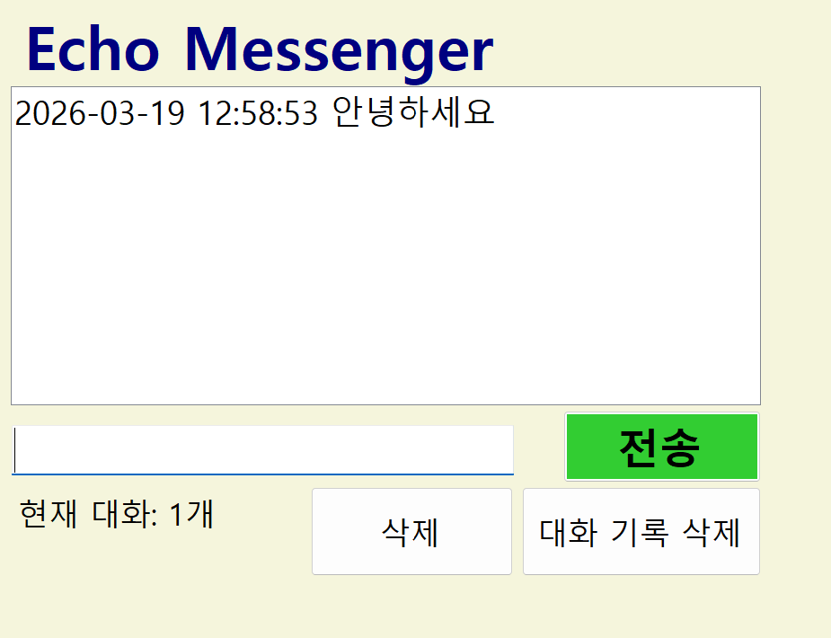

# (C# 코딩) 에코 메신저

## 개요
- C# 프로그래밍 학습
- 1줄 소개: 사용자 키보드 입력을 받아서 처리하는 프로그램
- 사용한 플랫폼:
  - C#, .NET Windows Forms, Visual Studio, GitHub
- 사용한 컨트롤:
  - Label, TextBox, ListBox, Button
- 사용한 기술과 구현한 기능:
  - Visual Studio를 이용하여 UI 디자인
  - string 클래스를 이용한 사용자 입력 데이터 처리
  - DateTime 클래스를 이용한 현재시간 정보 구하기
  - string.IsNullOrWhiteSpace를 이용한 빈 문자열 및 공백 검사
  - string.Trim()을 이용한 앞뒤 공백 제거
  - KeyEventArgs를 이용한 키보드 입력 이벤트 처리
  - MessageBox를 이용한 사용자 알림 메시지 표시
  - ListBox.Items 컬렉션을 이용한 항목 추가, 삭제, 전체 초기화
  - TextBox.MaxLength를 이용한 글자 수 제한

## 실행 화면 (과제1)
- 과제1 코드의 실행 스크린샷

- 과제 내용
  - Label(표시), TextBox(입력), Button(전송), ListBox(대화창)를 적절히 배치합니다.
  - 전송 버튼 클릭 시 TextBox의 텍스트를 ListBox의 항목(Items)으로 추가합니다.
  - 추가 직후 TextBox의 내용을 비워(Clear) 다음 입력을 준비합니다.
- 구현 내용과 기능 설명
  - 입력창에 메시지 입력하고 전송 버튼을 누르면 메시지가 리스트 박스에 표시된다.
  - 계속 반복하면 메시지가 리스트 박스에 한 줄씩 계속 추가된다.
  - 추가 내용이 많아지면 리스트 박스에 스크롤바가 자동으로 생기고 스크롤된다.

## 실행 화면 (과제2)
- 과제2 코드의 실행 스크린샷

- 과제 내용
  - 전송이 끝나면 입력창에 남겨진 기존 메시지를 삭제합니다.
  - 전송 후 커서를 자동으로 입력창에 둡니다.
  - Enter 키를 눌러도 메시지가 전송되도록 합니다.
  - 빈 문자열이나 공백만 있을 때는 메시지가 전송되지 않도록 방지합니다.
- 구현 내용과 기능 설명
  - txtInput.Clear()로 전송 후 입력창을 자동으로 비운다.
  - txtInput.Focus()로 전송 후 입력창에 포커스를 자동으로 이동한다.
  - KeyDown 이벤트에서 Keys.Enter를 감지하여 엔터키로도 전송이 가능하다.
  - string.IsNullOrWhiteSpace로 빈 문자열과 공백만 있는 입력을 차단한다.

## 실행 화면 (과제3)
- 과제3 코드의 실행 스크린샷

- 과제 내용
  - 메시지 앞에 현재 시간을 자동으로 결합하여 리스트에 출력합니다.
  - 현재 리스트에 쌓인 총 메시지 개수를 하단 Label에 실시간으로 업데이트합니다.
  - 사용자가 입력한 메시지의 앞뒤 불필요한 공백을 Trim()으로 제거합니다.
- 구현 내용과 기능 설명
  - DateTime.Now.ToString으로 현재 시간을 구해서 메시지 앞에 타임스탬프를 붙인다.
  - lstMessages.Items.Count로 메시지 개수를 세어 "현재 대화: N개" 형식으로 표시한다.
  - typed_msg.Trim()으로 사용자 입력의 앞뒤 공백을 깔끔하게 제거한다.

## 실행 화면 (과제4)
- 과제4 코드의 실행 스크린샷

- 과제 내용
  - ListBox에서 특정 메시지를 클릭하고 삭제 버튼을 누르면 해당 항목만 제거합니다.
  - 대화 기록 삭제 버튼을 클릭하면 리스트의 모든 내용을 한 번에 지웁니다.
  - 입력창에 글자 수를 50자로 제한하고, 초과시 경고 메시지를 띄웁니다.
- 구현 내용과 기능 설명
  - lstMessages.Items.Remove로 선택된 항목만 삭제할 수 있다.
  - 선택하지 않고 삭제 시 MessageBox로 안내 메시지를 표시하여 예외 처리한다.
  - lstMessages.Items.Clear로 대화 기록을 한 번에 전체 삭제할 수 있다.
  - TextBox의 MaxLength를 50으로 설정하여 입력 시점에서 글자 수를 제한한다.

## 배운 내용
- Label, TextBox, ListBox, Button 등 Windows Forms 컨트롤의 속성과 메소드를 활용하는 방법을 배웠습니다.
- 이벤트 핸들러를 이용한 사용자 입력 처리와 UI 업데이트 방법을 익혔습니다.
- string 클래스의 다양한 메소드(IsNullOrWhiteSpace, Trim 등)를 활용한 문자열 처리를 학습했습니다.
- DateTime 클래스를 이용한 시간 정보 획득과 문자열 포맷팅을 배웠습니다.
- ListBox의 Items 컬렉션을 이용한 데이터 관리(추가, 삭제, 초기화)를 학습했습니다.
